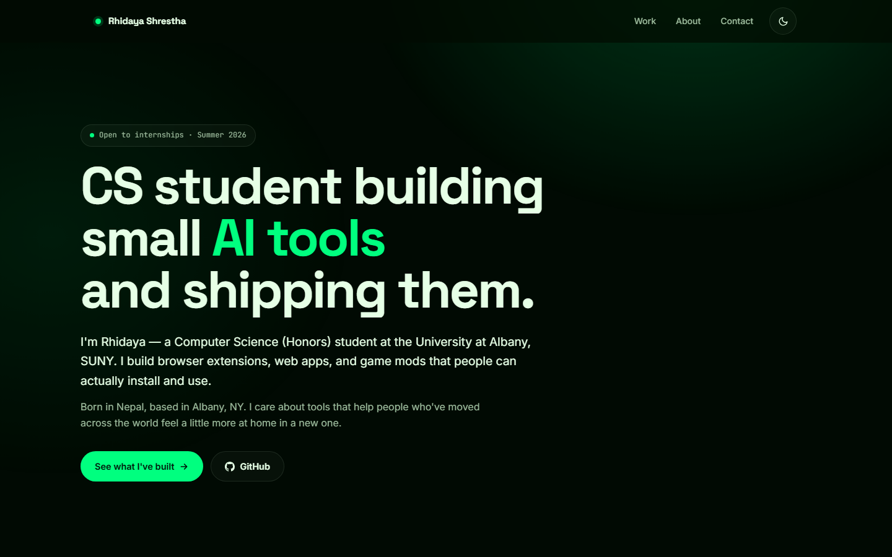

<div align="center">

# Rhidaya Shrestha — Portfolio

**A single-file, zero-dependency portfolio site showcasing shipped projects — Chrome extensions, AI tools, and game mods.**

[](https://potat4190.github.io/ProjectsDisplay/)
[](https://github.com/potat4190/ProjectsDisplay/actions/workflows/static.yml)


</div>

<br />



## About

This repo is the source for my personal portfolio — one handwritten `index.html`, no framework,
no bundler, no `node_modules`. It's deployed straight to GitHub Pages on every push to `main`.

The site showcases **9 shipped projects** (Chrome extensions, AI-powered desktop apps, a Java
battle simulator, a Minecraft mod, and more), each with a real "what it does" and "why it exists,"
plus links that go somewhere real — no dead buttons.

**Live:** **[potat4190.github.io/ProjectsDisplay](https://potat4190.github.io/ProjectsDisplay/)**

## Features

- **Filterable project grid** — filter by category (AI Tools, Web, Games & Mods) or language
  (Python, JavaScript, Java), with live result counts and an `aria-live` status line for screen
  readers. Filtering morphs the grid via the View Transitions API where supported.
- **Dark / light theme toggle** — full second palette (`MASTER.md`), swapped instantly with no
  flash, both verified at WCAG AA or better.
- **Scroll-driven motion, all native CSS** — masked header text reveal, image parallax, and a
  scroll-progress bar built on `animation-timeline: view()`/`scroll()`, with a JS fallback for
  browsers that don't support it yet.
- **Cursor-reactive cards** — a spotlight follows the pointer across each card (`pointer: fine`
  only) and CTA buttons have a subtle magnetic pull toward the cursor.
- **Fully responsive & accessible** — skip link, visible focus rings, sequential headings, 44px
  minimum touch targets, and a complete `prefers-reduced-motion` fallback that turns off every
  transform and transition while keeping content visible.
- **Fast by default** — images are WebP with `srcset`/`sizes`, explicit dimensions, and
  `loading="lazy"`; the original 4.58MB source photo set ships as 204KB (−96%). Zero JS
  dependencies, zero web fonts beyond the three already used for the wordmark.

## Tech stack

Plain HTML, CSS, and vanilla JavaScript — no framework, no build tooling, no package manager.
Everything (markup, styles, and behavior) lives in the one `index.html` file by design, so the
whole site can be understood by opening one file and reading top to bottom.

## Project structure

```
ProjectsDisplay/
├── index.html               # The entire site: markup, styles, and script
├── MASTER.md                # Design system — single source of truth for every token
├── images/
│   ├── optimized/            # WebP images actually referenced by the site
│   ├── Project Pictures/     # Source screenshots for project cards
│   └── My Pictures/          # Source portrait photography
└── .github/
    ├── workflows/static.yml  # Deploys to GitHub Pages on every push to main
    └── assets/               # Images used only in this README
```

## Design system

Every color, font size, spacing value, radius, and animation curve on the site is a token
defined once in **[`MASTER.md`](MASTER.md)** — nothing is a magic number. It documents the
"Terminal Green" visual direction (a green-tinted near-black interface with a single spring-green
accent), the full light/dark palette with verified WCAG contrast ratios, the type scale, motion
timing, and the "5 states" (`default · hover · focus-visible · active · disabled`) every
interactive component implements. Read it before changing any visual detail in `index.html`.

## Running locally

No install, no build step — it's a static file.

```bash
git clone https://github.com/potat4190/ProjectsDisplay.git
cd ProjectsDisplay
```

Then either open `index.html` directly in a browser, or serve it so relative image paths and
`fetch`-based features behave exactly as they will in production:

```bash
python -m http.server 8080
# → http://localhost:8080
```

Any static file server works (`npx serve`, VS Code's Live Server extension, etc.).

## Deployment

Pushing to `main` triggers **[`.github/workflows/static.yml`](.github/workflows/static.yml)**,
which uploads the repository as-is and publishes it to GitHub Pages — no build step in CI either.
The workflow can also be run manually from the Actions tab.

## Editing content

Projects are `<article class="card">` elements inside `#grid` in `index.html`; each one carries
a `data-tags` attribute the filter script reads (space-separated category/language keys). To add
a project, copy an existing card, update its copy, tags, links, and — if it has a screenshot —
add a `<picture>`/`` block matching the pattern used by the flagship cards, with a WebP
dropped into `images/optimized/`.

## License

No license file yet — this is a personal portfolio. Feel free to read the code for reference,
but please don't redeploy it as-is under your own name.

## Contact

- **Email:** [rshrestha2@albany.edu](mailto:rshrestha2@albany.edu)
- **LinkedIn:** [/in/rhidaya-shrestha](https://www.linkedin.com/in/rhidaya-shrestha-a52850322/)
- **GitHub:** [@potat4190](https://github.com/potat4190)
